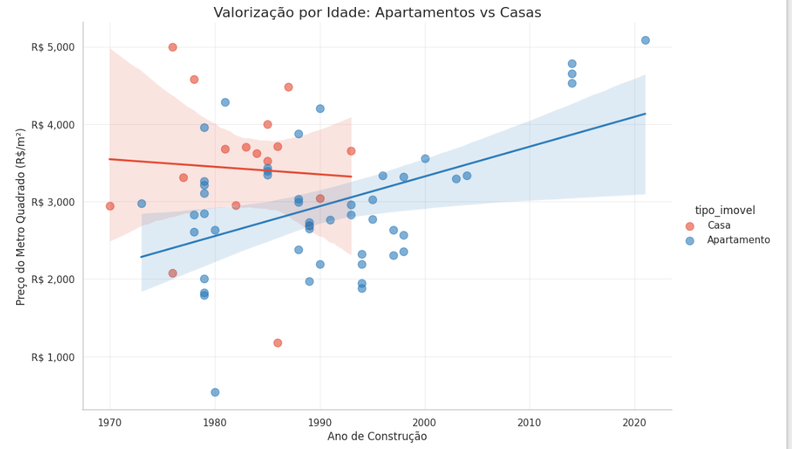
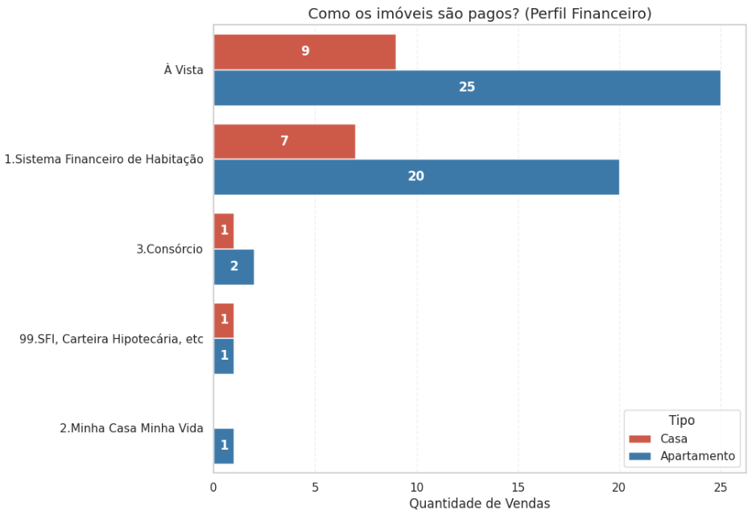
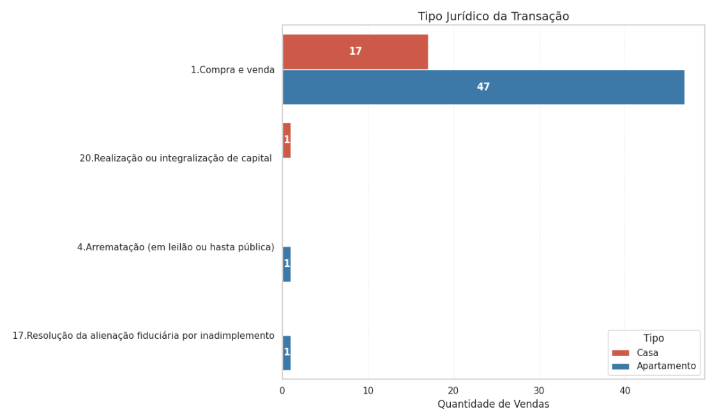
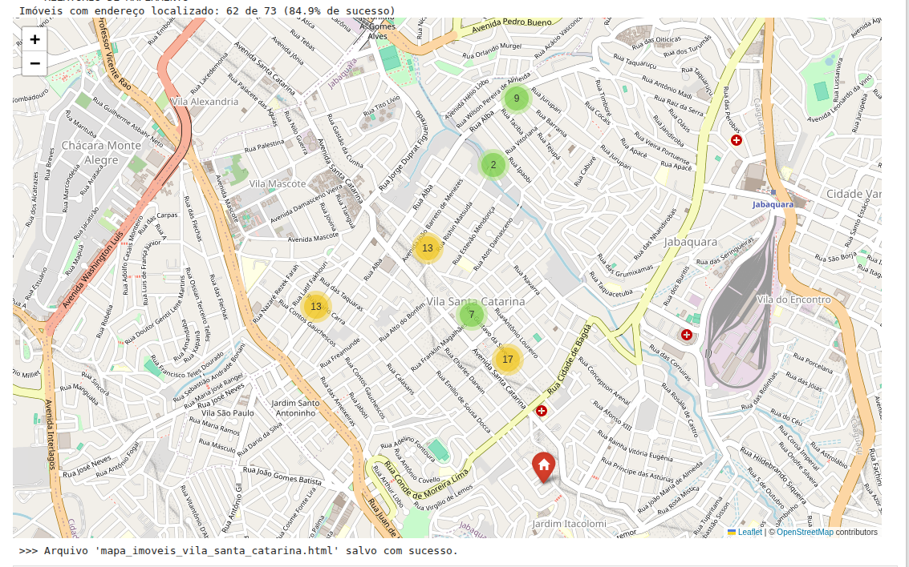
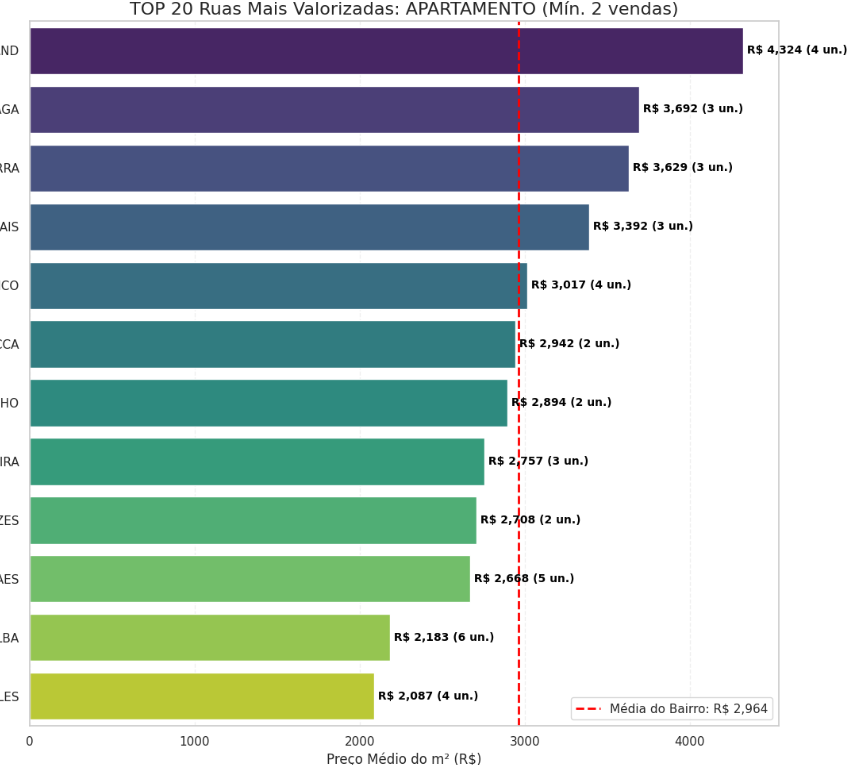

# Análise de Mercado Imobiliário

Este projeto utiliza dados públicos de transações reais (ITBI) e do cadastro fiscal (IPTU) da Prefeitura de São Paulo para estimar o valor de mercado de imóveis residenciais.

## Objetivo
Estimar o preço médio por m² de forma segmentada (por porte do imóvel e década de construção), indo além da média simples para encontrar uma avaliação que se aproxima da realidade utilizando dados públicos de transações reais (ITBI) e cadastro fiscal (IPTU). Trata-se de apenas estudo estatístico, não uma avaliação oficial.

## Contexto
Este é um projeto pessoal, feito por alguém que não é especialista no tema, mas que busca uma base de clareza e autonomia na percepção de mercado, utilizando o poder do Python e de dados públicos.

## Benefício
A grande beleza deste projeto é que ele é um ponto de partida de código aberto e pode ajudar outras pessoas. Se você desejar analisar seu próprio bairro, lembre-se: precisará adaptar o código, os critérios de limpeza e os filtros para a sua realidade. Este é um convite para a exploração e o aprendizado! :)

## ⚠️ Importante
Se você não tem familiaridade com análises de dados ou precisa de um valor com precisão legal ou profissional, é fundamental buscar a consultoria adequada de um profissional da área de avaliação imobiliária.
Este estudo foi realizado exclusivamente para fins educacionais e de demonstração de técnicas de engenharia de dados. Todos os dados utilizados são públicos e foram tratados para remover informações sensíveis, conforme boas práticas de privacidade. 

## Fonte dos Dados
A base para esta jornada analítica são os dados públicos de ITBI (Imposto sobre a Transmissão de Bens Imóveis) e informações cadastrais do IPTU, disponibilizados pela Prefeitura de São Paulo. Os dados de ITBI são públicos e podem ser baixados no portal da Prefeitura, na seção de Acesso à Informação.

---

## Metodologia

O projeto foi estruturado nas seguintes etapas técnicas:

1.  **Coleta e Limpeza:**
    * Consolidação de diversas abas de dados brutos (ITBI) com colunas difentes em cada mes.
    * Padronização de nomes de ruas e bairros para permitir cruzamentos.
    * Remoção de dados inconsistentes (vendas de frações ideais ou valores simbólicos).

2.  **Tratamento de Dados (Fusão de Escrituras):**
    * Um dos maiores desafios dos dados de SP é que apartamentos e vagas de garagem costumam ter escrituras separadas.
    * Criei um algoritmo que identifica e agrupa essas transações (mesmo endereço e data), somando os valores para chegar ao preço real do imóvel completo.

3.  **Geocodificação:**
    * Utilização da API Nominatim (OpenStreetMap) para converter os endereços em coordenadas de latitude e longitude, permitindo a análise espacial.

4.  **Análise Exploratória:**
    * Segmentação dos imóveis por faixa de metragem, idade do prédio e localização.

---

## Resultados e Visualizações

### 1. Preço por Porte do Imóvel
Para evitar a distorção da média geral, os imóveis foram segmentados por tamanho. A tabela abaixo mostra o valor do m² para cada perfil.

### 2. Valorização por Idade (Safra)
Relação entre o ano de construção e o preço do m². O gráfico separa Casas (vermelho) de Apartamentos (azul) para mostrar como a idade impacta cada tipo de forma diferente.

### 3. Dinâmica Temporal de Vendas
Acompanhamento mensal do volume de negócios, segmentado por tipo de imóvel. O gráfico permite identificar sazonalidade e a liquidez relativa entre Casas e Apartamentos ao longo do ano.

### 4. Perfil das Transações
Análise de como os imóveis são pagos (Financiamento vs À Vista) e o tipo jurídico da transação.

| Formas de Pagamento | Natureza da Transação |
| :---: | :---: |
|  |  |

### 5. Distribuição Espacial
Mapa das transações validadas na região.

### 6. Ruas Mais Valorizadas
Ranking das ruas com maior preço médio por m², considerando apenas logradouros com um volume mínimo de vendas para garantir a consistência estatística.

*Nota: Os nomes das ruas foram ocultados na imagem para preservar a privacidade dos dados.*

---

## Estrutura do Projeto

* `notebooks/`: O código completo da análise (`itbi-data-science-project.ipynb`).
* `img/`: Imagens e gráficos gerados pelo notebook.
* `requirements.txt`: Lista de bibliotecas necessárias para rodar o projeto.

## Como Executar

1.  Clone o repositório.
2.  Instale as dependências: `pip install -r requirements.txt`
3.  No portal da Prefeitura de São Paulo faça o download do arquivo ITBI na pasta `notebooks/`. 
4.  Execute o notebook na pasta `notebooks/`.

---
**Autor:** rosenfe
